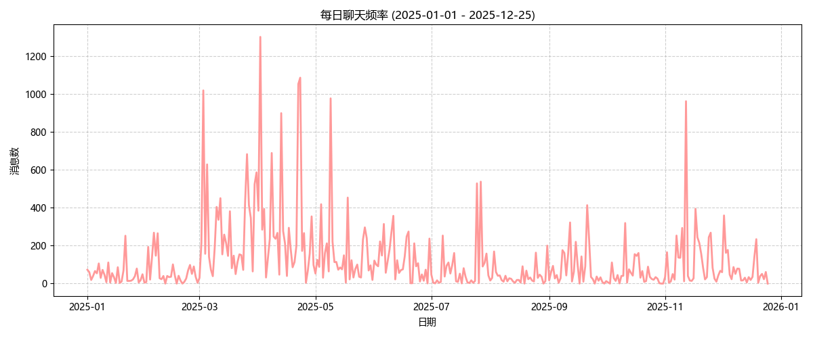
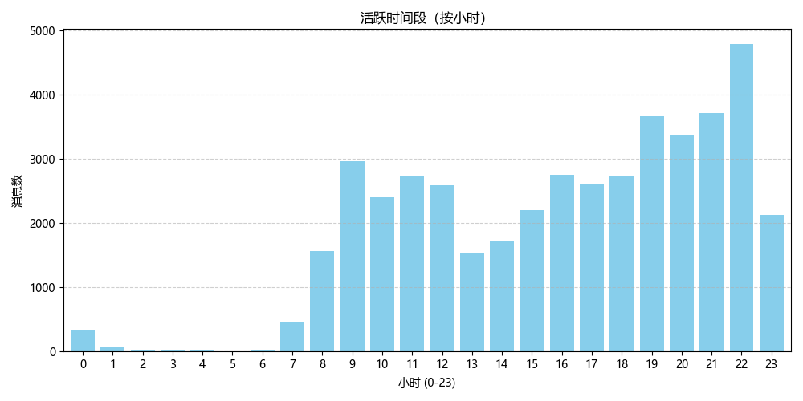
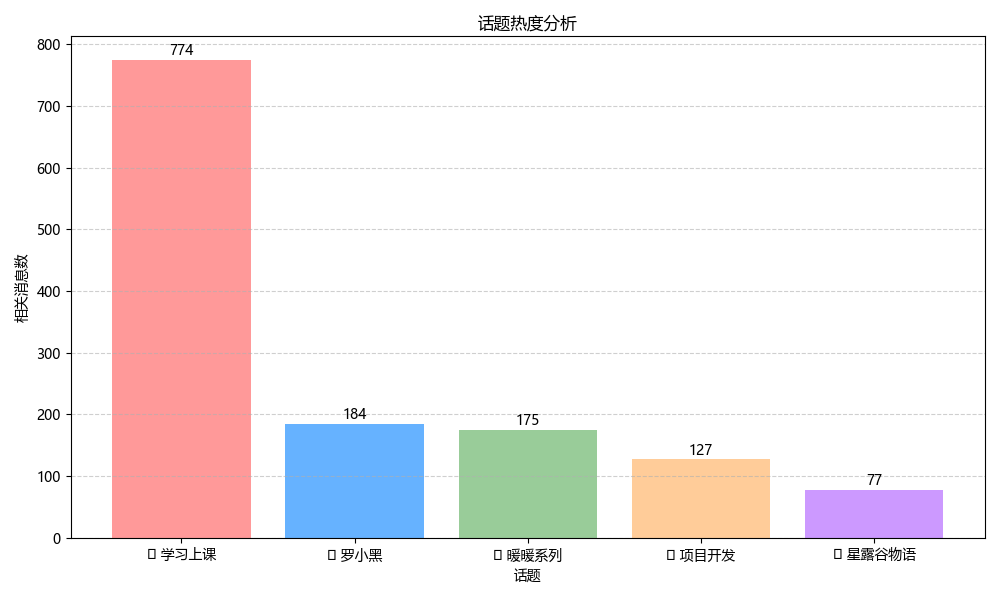

# � 2025 年度聊天报告

> 记录时间：2025-01-01 至 2025-12-25

## 📊 基础概览
- **总消息数**：44269
- **总字数**：458690
- **日均消息**：123.3

## 👥 谁是话痨？
| 昵称 | 消息数 | 字数 |
| --- | --- | --- |
| 邪恶小烩面😈 | 25151 | 239779 |
| Дерево | 19118 | 218911 |

## 📈 聊天频率分析
### 每日趋势

### 活跃时间段

## 🗣 高频话题与热词
### 📌 话题热度排行

#### 📚 学习上课 (共 774 条)
> 关键词：老师(203)、上课(114)、学习(83)、图书馆(81)、作业(81)

#### 🐱 罗小黑 (共 184 条)
> 关键词：无限(66)、罗小黑(37)、小黑(26)、清凝(16)、哪吒(13)

#### 👗 暖暖系列 (共 175 条)
> 关键词：暖暖(128)、叠纸(28)、大喵(8)、搭配(6)、套装(2)

#### 💻 项目开发 (共 127 条)
> 关键词：项目(49)、代码(29)、bug(18)、开发(12)、上线(5)

#### 🎮 星露谷物语 (共 77 条)
> 关键词：星露谷(49)、潘妮(8)、海莉(5)、艾米丽(3)、谢恩(3)

### 🔥 Top 20 热词
1. **喜欢** (289)
2. **阴险** (266)
3. **已经** (260)
4. **东西** (259)
5. **今天** (252)
6. **为什么** (239)
7. **恐惧** (237)
8. **不会** (236)
9. **哈哈哈哈** (233)
10. **发怒** (221)
11. **一直** (218)
12. **刚刚** (213)
13. **老师** (213)
14. **出来** (199)
15. **加油** (199)
16. **不想** (198)
17. **有点** (195)
18. **不要** (184)
19. **开始** (184)
20. **宝宝** (181)
